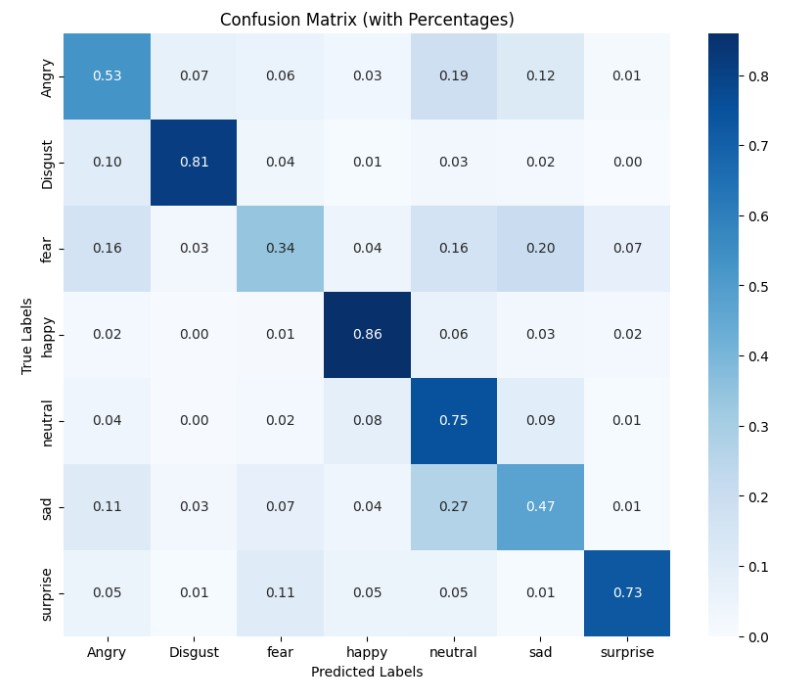

# Facial Emotion Recognition using Deep Learning Models

## Project Overview

- The project focuses on Facial Emotion Recognition (FER) using deep learning models, with a primary emphasis on the utilization of the FER 2013 dataset.
- Detailed explanation of the data acquisition, preprocessing, model architecture, loss function, metrics, and test-time augmentation.
- Description of the five-layer neural network architecture, hyperparameter tuning, and insights into the model's structure.
- Analysis of class imbalance solutions, adaptive learning rate and batch size optimization, model performance, and future direction

## Abstract

Facial Emotion Recognition (FER) is a rapidly evolving field with applications in human-computer interaction and mental health diagnostics. The project explores the challenges and innovations within FER, particularly using the FER 2013 dataset. The study employs cutting-edge deep learning techniques to enhance accuracy and robustness in recognizing emotions from facial expressions.

## How will this project help?
This project on Facial Emotion Recognition using deep learning models aims to enhance mental health diagnostics, entertainment experiences, and human-computer interaction by leveraging advanced methodologies and dataset optimizations, contributing to real-world applications and the continuous evolution of emotion recognition technologies.

## Resources Used
Packages: pandas, numpy, sklearn, matplotlib, seaborn, tensorflow.
Dataset from Kaggle: https://www.kaggle.com/datasets/msambare/fer2013

## Model Building and Evaluation
Metrics: Accuracy - 0.63

